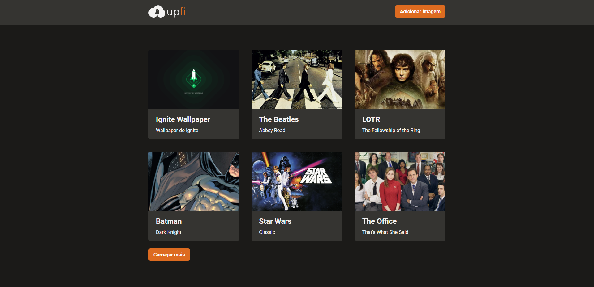
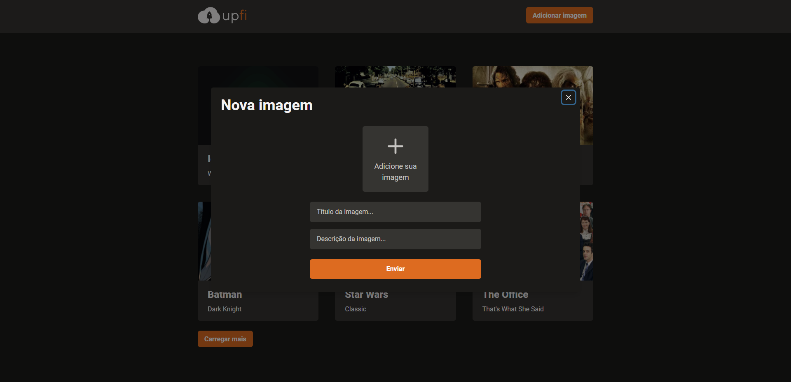
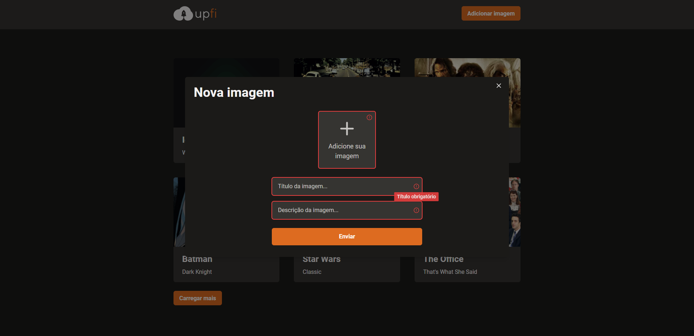

# Ignite Trilha React - Desafio 04

<h2 align="center">
  React Hook Form, React Query, Upload de imagens
</h2>

  

  

## :eyes: Preview da aplicação

## :rocket: Sobre o desafio

Neste desafio foram aplicados conceitos de validação de formulários usando React Hook Form e infinite queries e mutations utilizando React Query.

Principais funcionalidades:

- Upload de imagens;
- Listar imagens previamente carregadas;
- Carregar mais imagens ao clicar no botão de carregamento;
